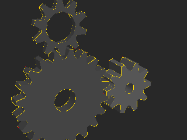
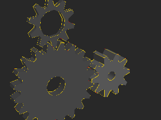
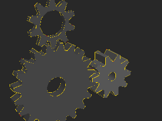
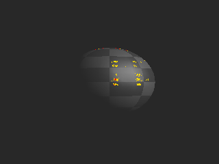
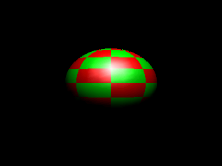
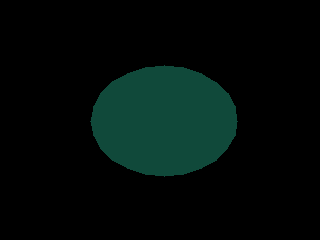
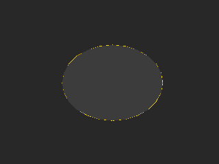
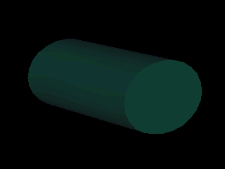
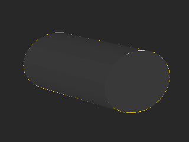
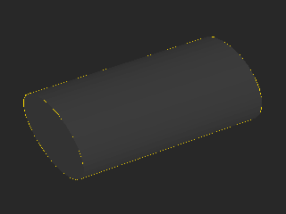

# glref report: f3f6/suite-3

Implementation under test: **ours**; reference: Mesa llvmpipe (cached in `../ref-mesa`).
Xvfb 800x480x16, deterministic time (1/60 s per swap), LD_BIND_NOW=1. Thresholds: channel tolerance 16/255, tolerant-bad <= 1.00% to PASS (see tools/glref/compare.py for why).

**Apps: 5.** MISSING-SYMBOL 1, PASS 4

| app | verdict | command |
|---|---|---|
| glxgears | **PASS** | `$XD/glxgears -geometry 320x240+0+0` |
| manywin | **PASS** | `$XD/manywin 4` |
| gears | **PASS** | `$GD/gears -geometry 320x240+0+0` |
| spectex | **PASS** | `$GD/spectex -geometry 320x240+0+0` |
| texcyl | **MISSING-SYMBOL** | `$GD/texcyl -geometry 320x240+0+0` |

## Per frame

| app | frame | verdict | strict bad % | tolerant bad % | max err | mean err | ours run | mesa ref | notes |
|---|---|---|---|---|---|---|---|---|---|
| glxgears | 3 | **PASS** | 1.070 | 0.020 | 247 | 0.72 | ok | ok |  |
| glxgears | 20 | **PASS** | 1.081 | 0.034 | 247 | 0.75 | ok | ok |  |
| glxgears | 60 | **PASS** | 1.096 | 0.030 | 247 | 0.77 | ok | ok |  |
| manywin | 4 | **PASS** | 0.000 | 0.000 | 9 | 0.45 | ok | ok |  |
| manywin | 20 | **PASS** | 0.000 | 0.000 | 9 | 0.45 | ok | ok |  |
| manywin | 60 | **PASS** | 0.000 | 0.000 | 9 | 0.45 | ok | ok |  |
| gears | 3 | **PASS** | 1.060 | 0.030 | 247 | 0.73 | ok | ok |  |
| gears | 20 | **PASS** | 1.204 | 0.017 | 247 | 0.78 | ok | ok |  |
| gears | 60 | **PASS** | 1.146 | 0.034 | 247 | 0.79 | ok | ok |  |
| spectex | 3 | **PASS** | 0.220 | 0.027 | 219 | 0.17 | ok | ok |  |
| spectex | 20 | **PASS** | 0.195 | 0.017 | 231 | 0.17 | ok | ok |  |
| spectex | 60 | **PASS** | 0.207 | 0.021 | 206 | 0.18 | ok | ok |  |
| texcyl | 3 | **MISSING-SYMBOL** | 0.164 | 0.000 | 73 | 0.30 | ok | ok | 1 'libGL: unimplemented' lines; counted as MISSING-SYMBOL (image alone: PASS); log: libGL: unimplemented glTexGeni; log: libGL: context 2 created (pid 1415, comm texcyl); log: libGL: context 3 created (pid 1415, comm texcyl); log: glref: ok at swap 3 -> /src/artifacts/gl/f3f6/suite-3/ours/texcyl.f3 |
| texcyl | 20 | **MISSING-SYMBOL** | 0.212 | 0.004 | 61 | 0.49 | ok | ok | 1 'libGL: unimplemented' lines; counted as MISSING-SYMBOL (image alone: PASS); log: libGL: unimplemented glTexGeni; log: libGL: context 2 created (pid 1467, comm texcyl); log: libGL: context 3 created (pid 1467, comm texcyl); log: glref: ok at swap 20 -> /src/artifacts/gl/f3f6/suite-3/ours/texcyl.f20 |
| texcyl | 60 | **MISSING-SYMBOL** | 0.236 | 0.000 | 69 | 0.33 | ok | ok | 1 'libGL: unimplemented' lines; counted as MISSING-SYMBOL (image alone: PASS); log: libGL: unimplemented glTexGeni; log: libGL: context 2 created (pid 1502, comm texcyl); log: libGL: context 3 created (pid 1502, comm texcyl); log: glref: ok at swap 60 -> /src/artifacts/gl/f3f6/suite-3/ours/texcyl.f60 |

## Images

Mesa reference, ours, diff (grey = reference, red = tolerant-bad, yellow = edge-only). EXACT frames have no diff image.

**glxgears f3: PASS**  
  

**glxgears f20: PASS**  
  

**glxgears f60: PASS**  
  

**manywin f4: PASS**  
  

**manywin f20: PASS**  
  

**manywin f60: PASS**  
  

**gears f3: PASS**  
  

**gears f20: PASS**  
  

**gears f60: PASS**  
  

**spectex f3: PASS**  
  

**spectex f20: PASS**  
  

**spectex f60: PASS**  
  

**texcyl f3: MISSING-SYMBOL**  
  

**texcyl f20: MISSING-SYMBOL**  
  

**texcyl f60: MISSING-SYMBOL**  
  

## xlite load arm (board X stack, load time only)

Each app and the GL libraries it loads, resolved with `ldd -r` (every
relocation, as musl binds) against our libGL + xlite libX11 + xstubs
libXext (+ xlite's libXrandr/libXxf86vm), built for the host from the
repo sources; libXi/libXrender are the host's, standing in for the
board's. LOADS means no undefined symbol; it says nothing about what
the calls then do.

| app | result | undefined symbols (library) |
|---|---|---|
| glxgears | LOADS | |
| glxinfo | LOADS | |
| glxheads | LOADS | |
| manywin | LOADS | |
| multictx | LOADS | |
| offset | LOADS | |
| glxgears_fbconfig | LOADS | |
| gears | LOADS | |
| morph3d | LOADS | |
| bounce | LOADS | |
| spectex | LOADS | |
| geartrain | LOADS | |
| ipers | LOADS | |
| terrain | LOADS | |
| tunnel | LOADS | |
| fire | LOADS | |
| teapot | LOADS | |
| texcyl | LOADS | |
| isosurf | LOADS | |

19 load, 0 would abort at load on the board.

These are gaps in xlite / the stub libraries (not libGL: every gl*/glX*
import resolves). Owners: xlite for libX11 names, xstubs for libXext.
