# glref report: f7/suite

Implementation under test: **ours**; reference: Mesa llvmpipe (cached in `../ref-mesa`).
Xvfb 800x480x16, deterministic time (1/60 s per swap), LD_BIND_NOW=1. Thresholds: channel tolerance 16/255, tolerant-bad <= 1.00% to PASS (see tools/glref/compare.py for why).

**Apps: 19.** FAIL 2, PASS 17

| app | verdict | command |
|---|---|---|
| glxgears | **PASS** | `$XD/glxgears -geometry 320x240+0+0` |
| glxinfo | **PASS** | `$XD/glxinfo` |
| glxheads | **PASS** | `$XD/glxheads` |
| manywin | **PASS** | `$XD/manywin 4` |
| multictx | **PASS** | `$XD/multictx` |
| offset | **PASS** | `$XD/offset` |
| glxgears_fbconfig | **PASS** | `$XD/glxgears_fbconfig` |
| gears | **PASS** | `$GD/gears -geometry 320x240+0+0` |
| morph3d | **PASS** | `$GD/morph3d -geometry 320x240+0+0` |
| bounce | **PASS** | `$GD/bounce -geometry 320x240+0+0` |
| spectex | **PASS** | `$GD/spectex -geometry 320x240+0+0` |
| geartrain | **PASS** | `$GD/geartrain -geometry 320x240+0+0` |
| ipers | **PASS** | `$GD/ipers -geometry 320x240+0+0` |
| terrain | **PASS** | `$GD/terrain -geometry 320x240+0+0` |
| tunnel | **PASS** | `$GD/tunnel -geometry 320x240+0+0` |
| fire | **FAIL** | `$GD/fire -geometry 320x240+0+0` |
| teapot | **FAIL** | `$GD/teapot -geometry 320x240+0+0` |
| texcyl | **PASS** | `$GD/texcyl -geometry 320x240+0+0` |
| isosurf | **PASS** | `$GD/isosurf` |

## Per frame

| app | frame | verdict | strict bad % | tolerant bad % | max err | mean err | ours run | mesa ref | notes |
|---|---|---|---|---|---|---|---|---|---|
| glxgears | 3 | **PASS** | 1.070 | 0.020 | 247 | 0.72 | ok | ok |  |
| glxgears | 20 | **PASS** | 1.081 | 0.034 | 247 | 0.75 | ok | ok |  |
| glxgears | 60 | **PASS** | 1.096 | 0.030 | 247 | 0.77 | ok | ok |  |
| glxinfo | 0 | **PASS** | - | - | - | - | exit | exit | OpenGL vendor string: s31; OpenGL renderer string: Software Rasterizer; OpenGL version string: 1.1 s31-tinygl; direct rendering: Yes; GLX version: 1.4 |
| glxheads | 3 | **PASS** | 0.316 | 0.000 | 132 | 5.76 | ok | ok |  |
| glxheads | 20 | **PASS** | 0.166 | 0.000 | 132 | 5.57 | ok | ok |  |
| glxheads | 60 | **PASS** | 0.232 | 0.000 | 132 | 5.66 | ok | ok |  |
| manywin | 4 | **PASS** | 0.000 | 0.000 | 9 | 0.45 | ok | ok |  |
| manywin | 20 | **PASS** | 0.000 | 0.000 | 9 | 0.45 | ok | ok |  |
| manywin | 60 | **PASS** | 0.000 | 0.000 | 9 | 0.45 | ok | ok |  |
| multictx | 20 | **PASS** | 0.004 | 0.003 | 91 | 0.01 | ok | ok |  |
| offset | 1 | **PASS** | 2.622 | 0.638 | 255 | 10.13 | ok | ok |  |
| glxgears_fbconfig | 3 | **PASS** | 0.380 | 0.004 | 197 | 0.37 | ok | ok |  |
| glxgears_fbconfig | 20 | **PASS** | 0.413 | 0.003 | 197 | 0.28 | ok | ok |  |
| glxgears_fbconfig | 60 | **PASS** | 0.333 | 0.001 | 197 | 0.60 | ok | ok |  |
| gears | 3 | **PASS** | 1.060 | 0.030 | 247 | 0.73 | ok | ok |  |
| gears | 20 | **PASS** | 1.204 | 0.017 | 247 | 0.78 | ok | ok |  |
| gears | 60 | **PASS** | 1.146 | 0.034 | 247 | 0.79 | ok | ok |  |
| morph3d | 3 | **PASS** | 0.138 | 0.099 | 255 | 0.11 | ok | ok |  |
| morph3d | 20 | **PASS** | 0.167 | 0.141 | 255 | 0.13 | ok | ok |  |
| morph3d | 60 | **PASS** | 0.254 | 0.195 | 255 | 0.17 | ok | ok |  |
| bounce | 3 | **PASS** | 6.837 | 0.030 | 255 | 11.62 | ok | ok |  |
| bounce | 20 | **PASS** | 6.747 | 0.013 | 255 | 11.50 | ok | ok |  |
| bounce | 60 | **PASS** | 6.822 | 0.048 | 255 | 11.60 | ok | ok |  |
| spectex | 3 | **PASS** | 0.220 | 0.027 | 219 | 0.17 | ok | ok |  |
| spectex | 20 | **PASS** | 0.195 | 0.017 | 231 | 0.17 | ok | ok |  |
| spectex | 60 | **PASS** | 0.207 | 0.021 | 206 | 0.18 | ok | ok |  |
| geartrain | 3 | **PASS** | 3.605 | 0.704 | 222 | 3.55 | ok | ok |  |
| geartrain | 20 | **PASS** | 3.516 | 0.680 | 222 | 3.50 | ok | ok |  |
| geartrain | 60 | **PASS** | 3.539 | 0.758 | 222 | 3.55 | ok | ok |  |
| ipers | 3 | **PASS** | 0.348 | 0.186 | 123 | 1.55 | ok | ok |  |
| ipers | 20 | **PASS** | 0.335 | 0.190 | 123 | 1.56 | ok | ok |  |
| ipers | 60 | **PASS** | 0.310 | 0.177 | 123 | 1.54 | ok | ok |  |
| terrain | 3 | **PASS** | 0.027 | 0.023 | 74 | 0.16 | ok | ok |  |
| terrain | 20 | **PASS** | 0.012 | 0.004 | 69 | 0.19 | ok | ok |  |
| terrain | 60 | **PASS** | 0.029 | 0.026 | 44 | 0.11 | ok | ok |  |
| tunnel | 3 | **PASS** | 0.806 | 0.350 | 148 | 2.10 | ok | ok |  |
| tunnel | 20 | **PASS** | 0.888 | 0.350 | 65 | 2.06 | ok | ok |  |
| tunnel | 60 | **PASS** | 0.469 | 0.219 | 148 | 1.91 | ok | ok |  |
| fire | 3 | **FAIL** | 6.246 | 3.078 | 206 | 3.25 | ok | ok |  |
| fire | 20 | **FAIL** | 6.292 | 3.158 | 148 | 3.41 | ok | ok |  |
| fire | 60 | **FAIL** | 6.026 | 3.039 | 148 | 3.13 | ok | ok |  |
| teapot | 3 | **FAIL** | 7.949 | 5.900 | 189 | 4.61 | ok | ok |  |
| teapot | 20 | **FAIL** | 8.104 | 6.079 | 189 | 4.64 | ok | ok |  |
| teapot | 60 | **FAIL** | 6.932 | 4.949 | 189 | 4.28 | ok | ok |  |
| texcyl | 3 | **PASS** | 0.164 | 0.000 | 73 | 0.30 | ok | ok |  |
| texcyl | 20 | **PASS** | 0.212 | 0.004 | 61 | 0.49 | ok | ok |  |
| texcyl | 60 | **PASS** | 0.236 | 0.000 | 69 | 0.33 | ok | ok |  |
| isosurf | 1 | **PASS** | 0.349 | 0.035 | 197 | 0.58 | ok | ok |  |

## Images

Mesa reference, ours, diff (grey = reference, red = tolerant-bad, yellow = edge-only). EXACT frames have no diff image.

**glxgears f3: PASS**  
  

**glxgears f20: PASS**  
  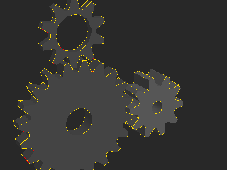

**glxgears f60: PASS**  
  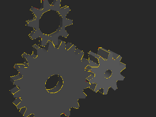

**glxheads f3: PASS**  
 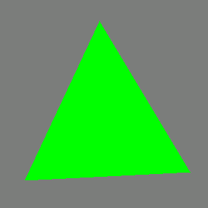 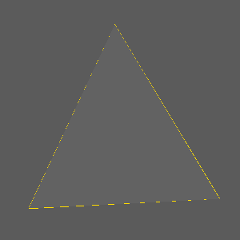

**glxheads f20: PASS**  
 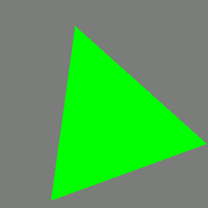 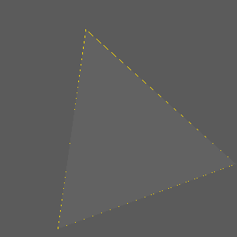

**glxheads f60: PASS**  
  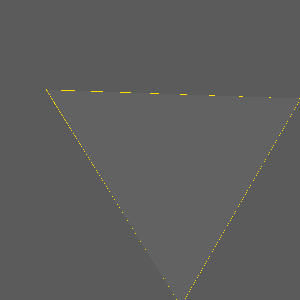

**manywin f4: PASS**  
  

**manywin f20: PASS**  
 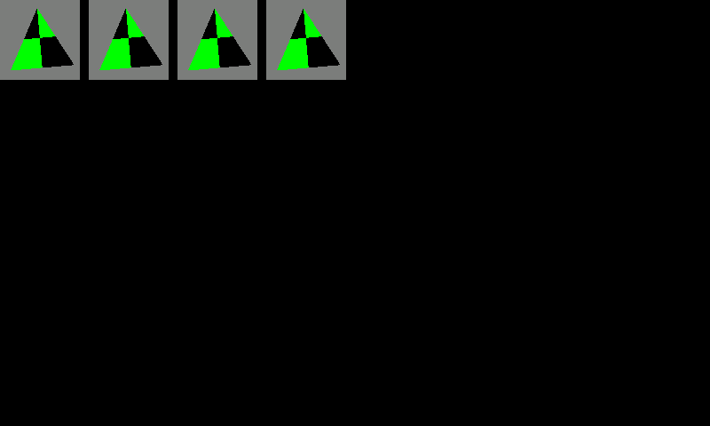 

**manywin f60: PASS**  
  

**multictx f20: PASS**  
 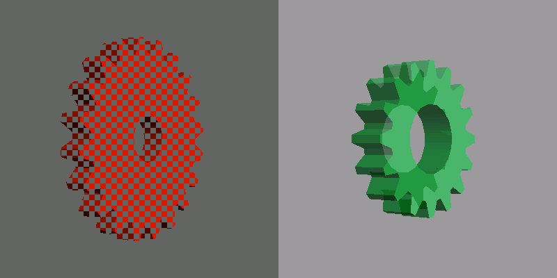 

**offset f1: PASS**  
 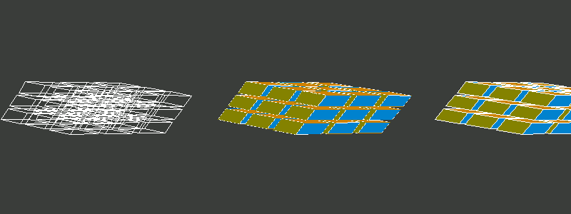 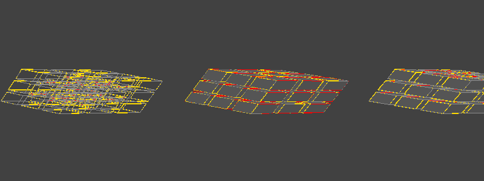

**glxgears_fbconfig f3: PASS**  
  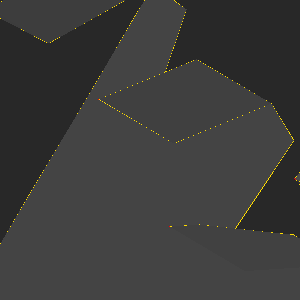

**glxgears_fbconfig f20: PASS**  
  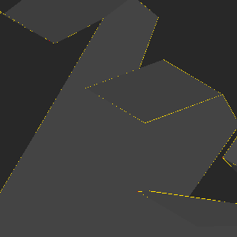

**glxgears_fbconfig f60: PASS**  
 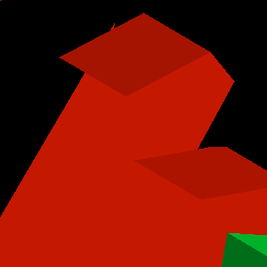 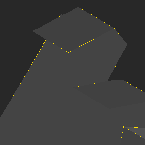

**gears f3: PASS**  
  

**gears f20: PASS**  
  

**gears f60: PASS**  
  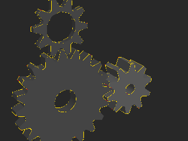

**morph3d f3: PASS**  
 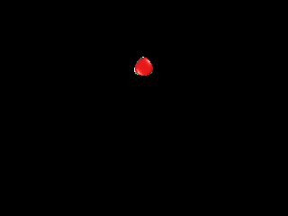 

**morph3d f20: PASS**  
 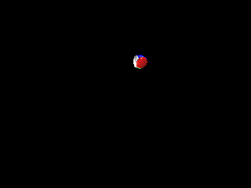 

**morph3d f60: PASS**  
 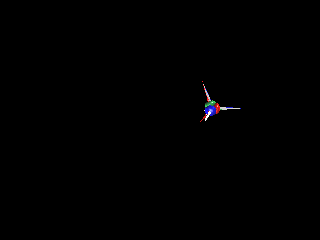 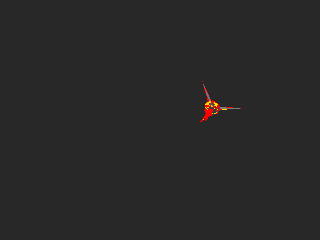

**bounce f3: PASS**  
 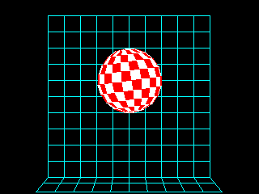 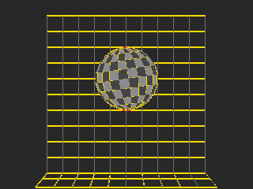

**bounce f20: PASS**  
 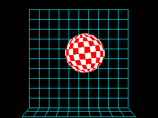 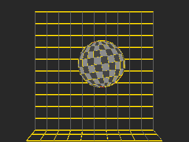

**bounce f60: PASS**  
 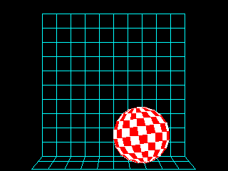 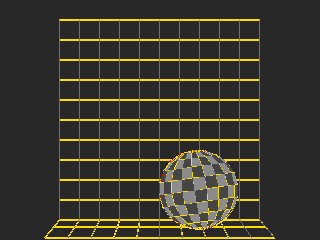

**spectex f3: PASS**  
 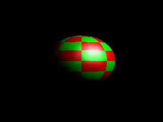 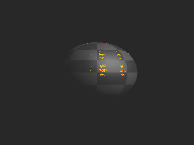

**spectex f20: PASS**  
 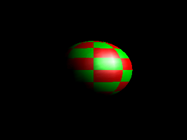 

**spectex f60: PASS**  
  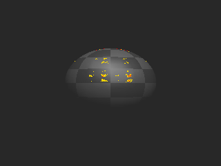

**geartrain f3: PASS**  
  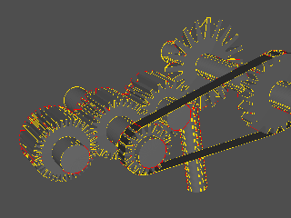

**geartrain f20: PASS**  
 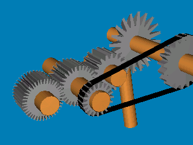 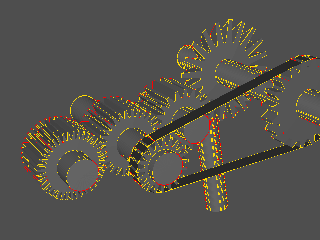

**geartrain f60: PASS**  
 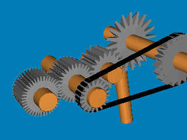 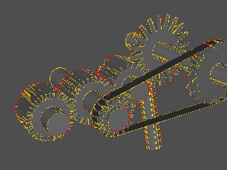

**ipers f3: PASS**  
 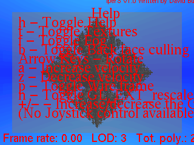 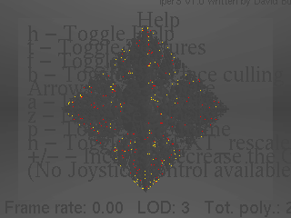

**ipers f20: PASS**  
 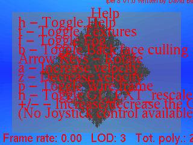 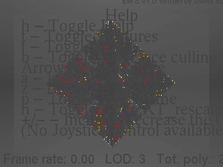

**ipers f60: PASS**  
 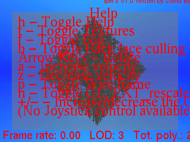 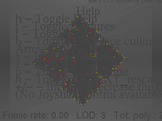

**terrain f3: PASS**  
 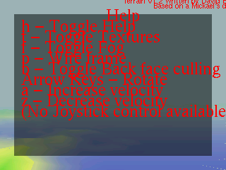 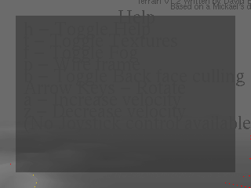

**terrain f20: PASS**  
 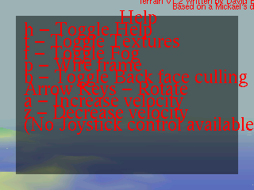 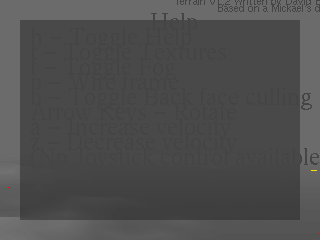

**terrain f60: PASS**  
 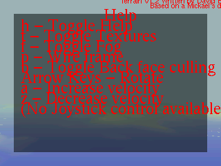 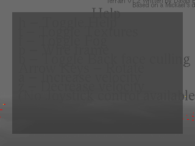

**tunnel f3: PASS**  
 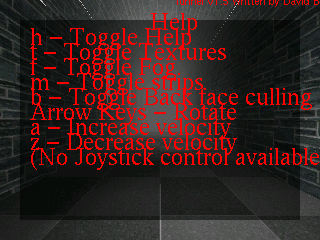 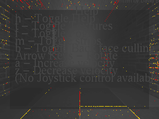

**tunnel f20: PASS**  
 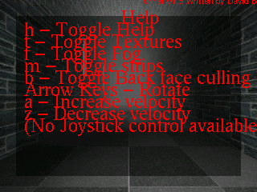 

**tunnel f60: PASS**  
  

**fire f3: FAIL**  
  

**fire f20: FAIL**  
  

**fire f60: FAIL**  
  

**teapot f3: FAIL**  
  

**teapot f20: FAIL**  
  

**teapot f60: FAIL**  
  

**texcyl f3: PASS**  
  

**texcyl f20: PASS**  
  

**texcyl f60: PASS**  
  

**isosurf f1: PASS**  
  

## xlite load arm (board X stack, load time only)

Each app and the GL libraries it loads, resolved with `ldd -r` (every
relocation, as musl binds) against our libGL + xlite libX11 + xstubs
libXext (+ xlite's libXrandr/libXxf86vm), built for the host from the
repo sources; libXi/libXrender are the host's, standing in for the
board's. LOADS means no undefined symbol; it says nothing about what
the calls then do.

| app | result | undefined symbols (library) |
|---|---|---|
| glxgears | LOADS | |
| glxinfo | LOADS | |
| glxheads | LOADS | |
| manywin | LOADS | |
| multictx | LOADS | |
| offset | LOADS | |
| glxgears_fbconfig | LOADS | |
| gears | LOADS | |
| morph3d | LOADS | |
| bounce | LOADS | |
| spectex | LOADS | |
| geartrain | LOADS | |
| ipers | LOADS | |
| terrain | LOADS | |
| tunnel | LOADS | |
| fire | LOADS | |
| teapot | LOADS | |
| texcyl | LOADS | |
| isosurf | LOADS | |

19 load, 0 would abort at load on the board.

These are gaps in xlite / the stub libraries (not libGL: every gl*/glX*
import resolves). Owners: xlite for libX11 names, xstubs for libXext.
