# glref report: phase2/selftest-mesa

Implementation under test: **mesa**; reference: Mesa llvmpipe (cached in `../ref-mesa`).
Xvfb 800x480x16, deterministic time (1/60 s per swap), LD_BIND_NOW=1. Thresholds: channel tolerance 16/255, tolerant-bad <= 1.00% to PASS (see tools/glref/compare.py for why).

**Apps: 22.** PASS 1, EXACT 21

| app | verdict | command |
|---|---|---|
| glxgears | **EXACT** | `$XD/glxgears -geometry 320x240+0+0` |
| glxinfo | **PASS** | `$XD/glxinfo` |
| glxheads | **EXACT** | `$XD/glxheads` |
| manywin | **EXACT** | `$XD/manywin 4` |
| multictx | **EXACT** | `$XD/multictx` |
| offset | **EXACT** | `$XD/offset` |
| glxgears_fbconfig | **EXACT** | `$XD/glxgears_fbconfig` |
| gears | **EXACT** | `$GD/gears -geometry 320x240+0+0` |
| morph3d | **EXACT** | `$GD/morph3d -geometry 320x240+0+0` |
| bounce | **EXACT** | `$GD/bounce -geometry 320x240+0+0` |
| spectex | **EXACT** | `$GD/spectex -geometry 320x240+0+0` |
| geartrain | **EXACT** | `$GD/geartrain -geometry 320x240+0+0` |
| ipers | **EXACT** | `$GD/ipers -geometry 320x240+0+0` |
| terrain | **EXACT** | `$GD/terrain -geometry 320x240+0+0` |
| tunnel | **EXACT** | `$GD/tunnel -geometry 320x240+0+0` |
| fire | **EXACT** | `$GD/fire -geometry 320x240+0+0` |
| teapot | **EXACT** | `$GD/teapot -geometry 320x240+0+0` |
| texcyl | **EXACT** | `$GD/texcyl -geometry 320x240+0+0` |
| isosurf | **EXACT** | `$GD/isosurf` |
| testgl | **EXACT** | `$SB/sdl12-test/testgl` |
| testgl2 | **EXACT** | `$SB/sdl2-test/testgl2 --geometry 320x240` |
| rrootage | **EXACT** | `$SB/rrootage/rr -lowres -window -nosound` |

## Per frame

| app | frame | verdict | strict bad % | tolerant bad % | max err | mean err | mesa run | mesa ref | notes |
|---|---|---|---|---|---|---|---|---|---|
| glxgears | 3 | **EXACT** | 0.000 | 0.000 | 0 | 0.00 | ok | ok |  |
| glxgears | 20 | **EXACT** | 0.000 | 0.000 | 0 | 0.00 | ok | ok |  |
| glxgears | 60 | **EXACT** | 0.000 | 0.000 | 0 | 0.00 | ok | ok |  |
| glxinfo | 0 | **PASS** | - | - | - | - | exit | exit | OpenGL vendor string: Mesa; OpenGL renderer string: llvmpipe (LLVM 19.1.7, 128 bits); OpenGL version string: 4.5 (Compatibility Profile) Mesa 25.0.7-2+deb13u1; direct rendering: Yes; GLX version: 1.4 |
| glxheads | 3 | **EXACT** | 0.000 | 0.000 | 0 | 0.00 | ok | ok |  |
| glxheads | 20 | **EXACT** | 0.000 | 0.000 | 0 | 0.00 | ok | ok |  |
| glxheads | 60 | **EXACT** | 0.000 | 0.000 | 0 | 0.00 | ok | ok |  |
| manywin | 4 | **EXACT** | 0.000 | 0.000 | 0 | 0.00 | ok | ok |  |
| manywin | 20 | **EXACT** | 0.000 | 0.000 | 0 | 0.00 | ok | ok |  |
| manywin | 60 | **EXACT** | 0.000 | 0.000 | 0 | 0.00 | ok | ok |  |
| multictx | 20 | **EXACT** | 0.000 | 0.000 | 0 | 0.00 | ok | ok |  |
| offset | 1 | **EXACT** | 0.000 | 0.000 | 0 | 0.00 | ok | ok |  |
| glxgears_fbconfig | 3 | **EXACT** | 0.000 | 0.000 | 0 | 0.00 | ok | ok |  |
| glxgears_fbconfig | 20 | **EXACT** | 0.000 | 0.000 | 0 | 0.00 | ok | ok |  |
| glxgears_fbconfig | 60 | **EXACT** | 0.000 | 0.000 | 0 | 0.00 | ok | ok |  |
| gears | 3 | **EXACT** | 0.000 | 0.000 | 0 | 0.00 | ok | ok |  |
| gears | 20 | **EXACT** | 0.000 | 0.000 | 0 | 0.00 | ok | ok |  |
| gears | 60 | **EXACT** | 0.000 | 0.000 | 0 | 0.00 | ok | ok |  |
| morph3d | 3 | **EXACT** | 0.000 | 0.000 | 0 | 0.00 | ok | ok |  |
| morph3d | 20 | **EXACT** | 0.000 | 0.000 | 0 | 0.00 | ok | ok |  |
| morph3d | 60 | **EXACT** | 0.000 | 0.000 | 0 | 0.00 | ok | ok |  |
| bounce | 3 | **EXACT** | 0.000 | 0.000 | 0 | 0.00 | ok | ok |  |
| bounce | 20 | **EXACT** | 0.000 | 0.000 | 0 | 0.00 | ok | ok |  |
| bounce | 60 | **EXACT** | 0.000 | 0.000 | 0 | 0.00 | ok | ok |  |
| spectex | 3 | **EXACT** | 0.000 | 0.000 | 0 | 0.00 | ok | ok |  |
| spectex | 20 | **EXACT** | 0.000 | 0.000 | 0 | 0.00 | ok | ok |  |
| spectex | 60 | **EXACT** | 0.000 | 0.000 | 0 | 0.00 | ok | ok |  |
| geartrain | 3 | **EXACT** | 0.000 | 0.000 | 0 | 0.00 | ok | ok |  |
| geartrain | 20 | **EXACT** | 0.000 | 0.000 | 0 | 0.00 | ok | ok |  |
| geartrain | 60 | **EXACT** | 0.000 | 0.000 | 0 | 0.00 | ok | ok |  |
| ipers | 3 | **EXACT** | 0.000 | 0.000 | 0 | 0.00 | ok | ok |  |
| ipers | 20 | **EXACT** | 0.000 | 0.000 | 0 | 0.00 | ok | ok |  |
| ipers | 60 | **EXACT** | 0.000 | 0.000 | 0 | 0.00 | ok | ok |  |
| terrain | 3 | **EXACT** | 0.000 | 0.000 | 0 | 0.00 | ok | ok |  |
| terrain | 20 | **EXACT** | 0.000 | 0.000 | 0 | 0.00 | ok | ok |  |
| terrain | 60 | **EXACT** | 0.000 | 0.000 | 0 | 0.00 | ok | ok |  |
| tunnel | 3 | **EXACT** | 0.000 | 0.000 | 0 | 0.00 | ok | ok |  |
| tunnel | 20 | **EXACT** | 0.000 | 0.000 | 0 | 0.00 | ok | ok |  |
| tunnel | 60 | **EXACT** | 0.000 | 0.000 | 0 | 0.00 | ok | ok |  |
| fire | 3 | **EXACT** | 0.000 | 0.000 | 0 | 0.00 | ok | ok |  |
| fire | 20 | **EXACT** | 0.000 | 0.000 | 0 | 0.00 | ok | ok |  |
| fire | 60 | **EXACT** | 0.000 | 0.000 | 0 | 0.00 | ok | ok |  |
| teapot | 3 | **EXACT** | 0.000 | 0.000 | 0 | 0.00 | ok | ok |  |
| teapot | 20 | **EXACT** | 0.000 | 0.000 | 0 | 0.00 | ok | ok |  |
| teapot | 60 | **EXACT** | 0.000 | 0.000 | 0 | 0.00 | ok | ok |  |
| texcyl | 3 | **EXACT** | 0.000 | 0.000 | 0 | 0.00 | ok | ok |  |
| texcyl | 20 | **EXACT** | 0.000 | 0.000 | 0 | 0.00 | ok | ok |  |
| texcyl | 60 | **EXACT** | 0.000 | 0.000 | 0 | 0.00 | ok | ok |  |
| isosurf | 1 | **EXACT** | 0.000 | 0.000 | 0 | 0.00 | ok | ok |  |
| testgl | 3 | **EXACT** | 0.000 | 0.000 | 0 | 0.00 | ok | ok |  |
| testgl | 20 | **EXACT** | 0.000 | 0.000 | 0 | 0.00 | ok | ok |  |
| testgl | 60 | **EXACT** | 0.000 | 0.000 | 0 | 0.00 | ok | ok |  |
| testgl2 | 3 | **EXACT** | 0.000 | 0.000 | 0 | 0.00 | ok | ok |  |
| testgl2 | 20 | **EXACT** | 0.000 | 0.000 | 0 | 0.00 | ok | ok |  |
| testgl2 | 60 | **EXACT** | 0.000 | 0.000 | 0 | 0.00 | ok | ok |  |
| rrootage | 3 | **EXACT** | 0.000 | 0.000 | 0 | 0.00 | ok | ok |  |
| rrootage | 60 | **EXACT** | 0.000 | 0.000 | 0 | 0.00 | ok | ok |  |
| rrootage | 300 | **EXACT** | 0.000 | 0.000 | 0 | 0.00 | ok | ok |  |

## Images

Mesa reference, mesa, diff (grey = reference, red = tolerant-bad, yellow = edge-only). EXACT frames have no diff image.

**glxgears f3: EXACT**  
  -

**glxgears f20: EXACT**  
  -

**glxgears f60: EXACT**  
  -

**glxheads f3: EXACT**  
 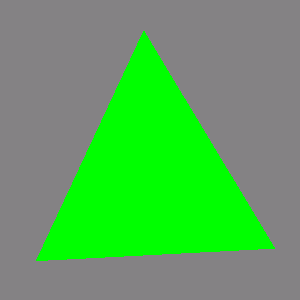 -

**glxheads f20: EXACT**  
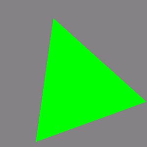  -

**glxheads f60: EXACT**  
  -

**manywin f4: EXACT**  
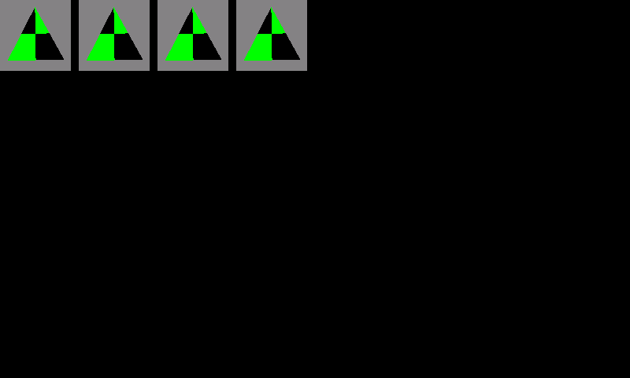  -

**manywin f20: EXACT**  
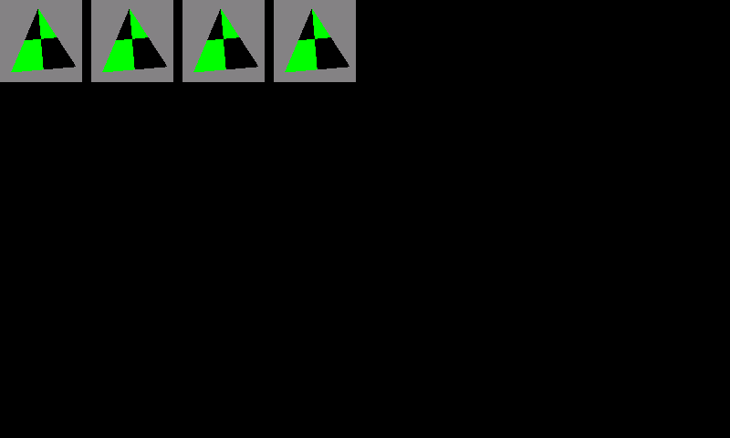  -

**manywin f60: EXACT**  
  -

**multictx f20: EXACT**  
 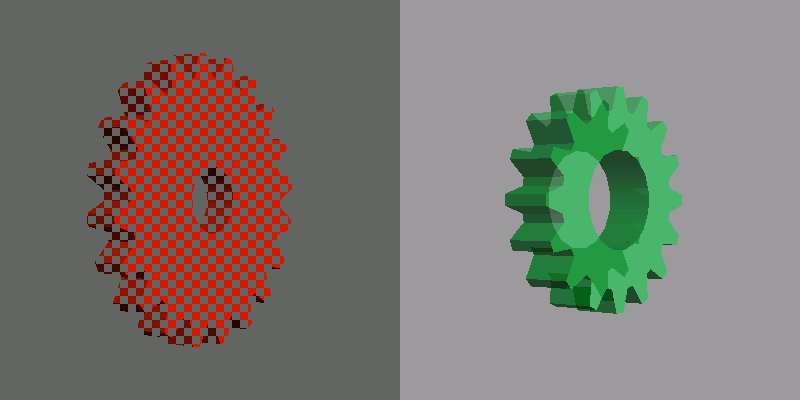 -

**offset f1: EXACT**  
 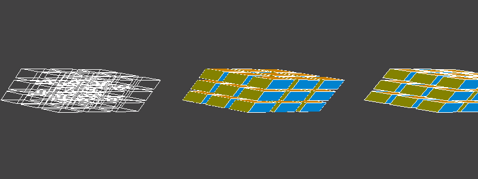 -

**glxgears_fbconfig f3: EXACT**  
  -

**glxgears_fbconfig f20: EXACT**  
  -

**glxgears_fbconfig f60: EXACT**  
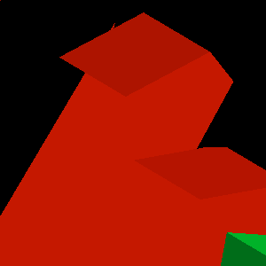  -

**gears f3: EXACT**  
  -

**gears f20: EXACT**  
  -

**gears f60: EXACT**  
  -

**morph3d f3: EXACT**  
  -

**morph3d f20: EXACT**  
 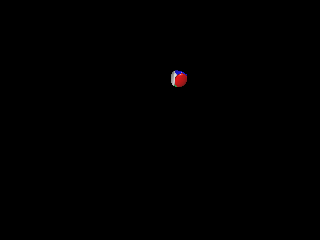 -

**morph3d f60: EXACT**  
 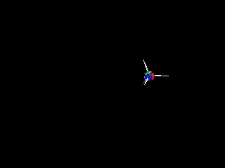 -

**bounce f3: EXACT**  
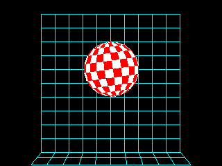  -

**bounce f20: EXACT**  
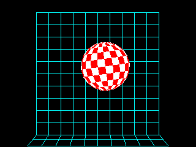  -

**bounce f60: EXACT**  
 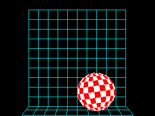 -

**spectex f3: EXACT**  
 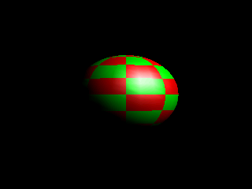 -

**spectex f20: EXACT**  
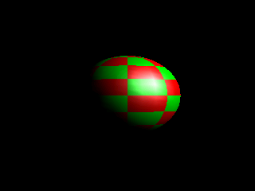  -

**spectex f60: EXACT**  
 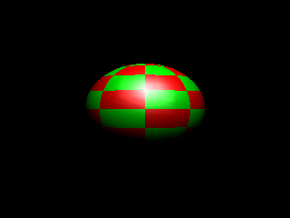 -

**geartrain f3: EXACT**  
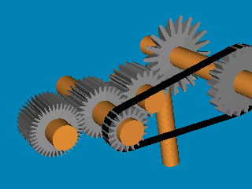  -

**geartrain f20: EXACT**  
 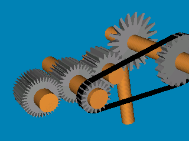 -

**geartrain f60: EXACT**  
  -

**ipers f3: EXACT**  
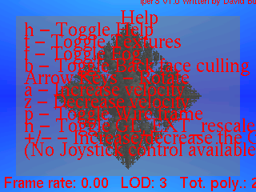  -

**ipers f20: EXACT**  
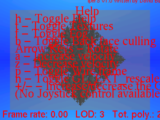  -

**ipers f60: EXACT**  
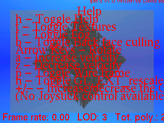  -

**terrain f3: EXACT**  
 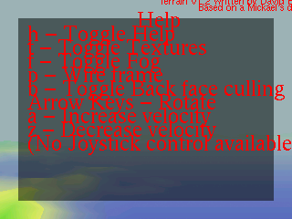 -

**terrain f20: EXACT**  
 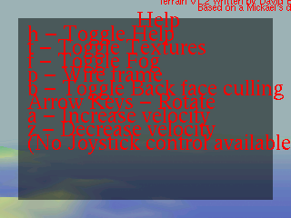 -

**terrain f60: EXACT**  
 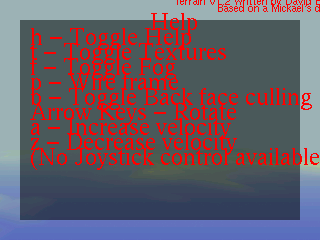 -

**tunnel f3: EXACT**  
 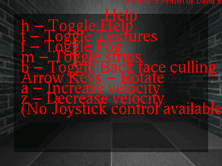 -

**tunnel f20: EXACT**  
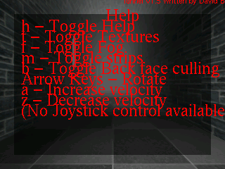  -

**tunnel f60: EXACT**  
 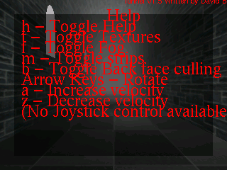 -

**fire f3: EXACT**  
 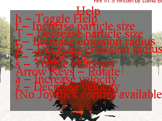 -

**fire f20: EXACT**  
 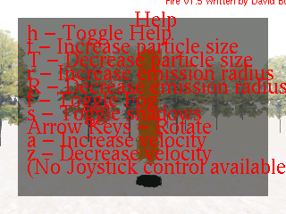 -

**fire f60: EXACT**  
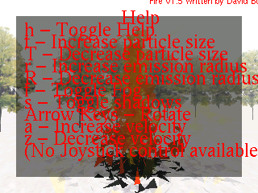  -

**teapot f3: EXACT**  
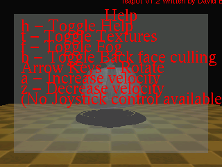  -

**teapot f20: EXACT**  
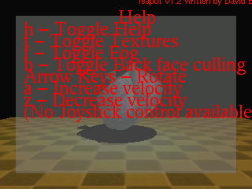  -

**teapot f60: EXACT**  
 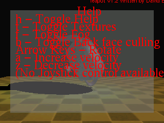 -

**texcyl f3: EXACT**  
  -

**texcyl f20: EXACT**  
 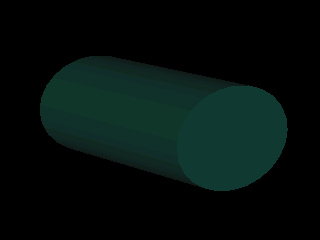 -

**texcyl f60: EXACT**  
 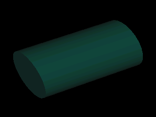 -

**isosurf f1: EXACT**  
 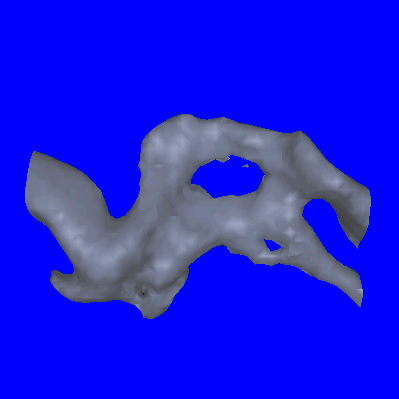 -

**testgl f3: EXACT**  
 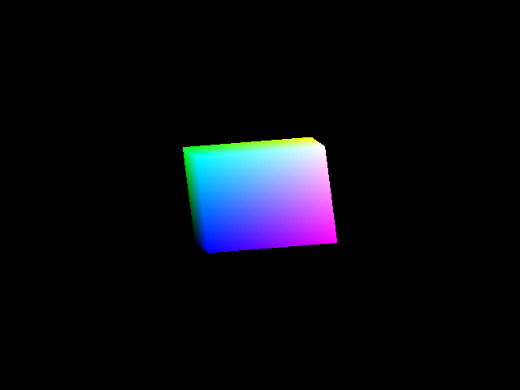 -

**testgl f20: EXACT**  
 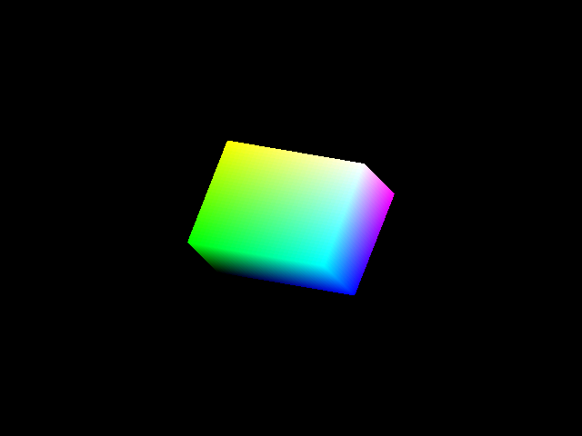 -

**testgl f60: EXACT**  
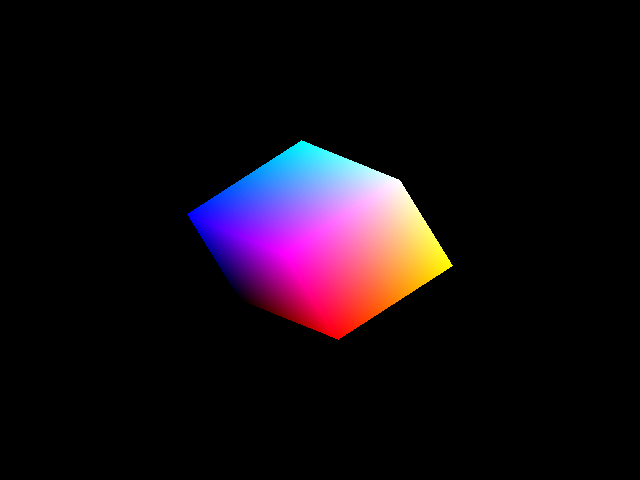  -

**testgl2 f3: EXACT**  
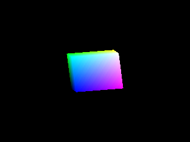  -

**testgl2 f20: EXACT**  
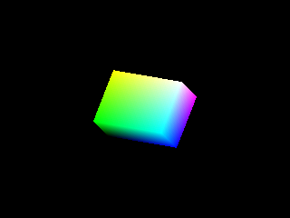  -

**testgl2 f60: EXACT**  
  -

**rrootage f3: EXACT**  
 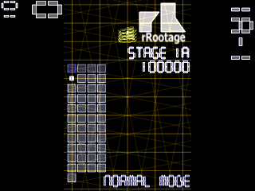 -

**rrootage f60: EXACT**  
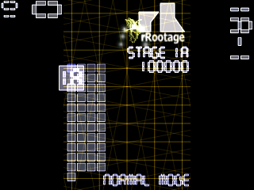  -

**rrootage f300: EXACT**  
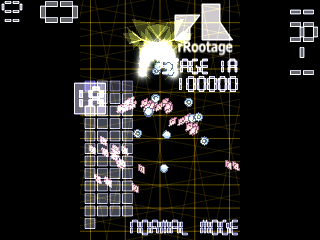  -

