# glref report: phase3a/fix-final/suite

Implementation under test: **ours**; reference: Mesa llvmpipe (cached in `../../ref-mesa`).
Xvfb 800x480x16, deterministic time (1/60 s per swap), LD_BIND_NOW=1. Thresholds: channel tolerance 16/255, tolerant-bad <= 1.00% to PASS (see tools/glref/compare.py for why).

**Apps: 22.** MISSING-SYMBOL 1, ERROR 1, FAIL 3, PASS 17

| app | verdict | command |
|---|---|---|
| glxgears | **PASS** | `$XD/glxgears -geometry 320x240+0+0` |
| glxinfo | **PASS** | `$XD/glxinfo` |
| glxheads | **PASS** | `$XD/glxheads` |
| manywin | **PASS** | `$XD/manywin 4` |
| multictx | **PASS** | `$XD/multictx` |
| offset | **PASS** | `$XD/offset` |
| glxgears_fbconfig | **PASS** | `$XD/glxgears_fbconfig` |
| gears | **PASS** | `$GD/gears -geometry 320x240+0+0` |
| morph3d | **PASS** | `$GD/morph3d -geometry 320x240+0+0` |
| bounce | **PASS** | `$GD/bounce -geometry 320x240+0+0` |
| spectex | **PASS** | `$GD/spectex -geometry 320x240+0+0` |
| geartrain | **PASS** | `$GD/geartrain -geometry 320x240+0+0` |
| ipers | **PASS** | `$GD/ipers -geometry 320x240+0+0` |
| terrain | **PASS** | `$GD/terrain -geometry 320x240+0+0` |
| tunnel | **PASS** | `$GD/tunnel -geometry 320x240+0+0` |
| fire | **FAIL** | `$GD/fire -geometry 320x240+0+0` |
| teapot | **FAIL** | `$GD/teapot -geometry 320x240+0+0` |
| texcyl | **PASS** | `$GD/texcyl -geometry 320x240+0+0` |
| isosurf | **PASS** | `$GD/isosurf` |
| testgl | **FAIL** | `$SB/sdl12-test/testgl` |
| testgl2 | **ERROR** | `$SB/sdl2-test/testgl2 --geometry 320x240` |
| rrootage | **MISSING-SYMBOL** | `$SB/rrootage/rr -lowres -window -nosound` |

## Per frame

| app | frame | verdict | strict bad % | tolerant bad % | max err | mean err | ours run | mesa ref | notes |
|---|---|---|---|---|---|---|---|---|---|
| glxgears | 3 | **PASS** | 0.004 | 0.000 | 173 | 0.15 | ok | ok |  |
| glxgears | 20 | **PASS** | 0.000 | 0.000 | 16 | 0.17 | ok | ok |  |
| glxgears | 60 | **PASS** | 0.001 | 0.000 | 154 | 0.18 | ok | ok |  |
| glxinfo | 0 | **PASS** | - | - | - | - | exit | exit | OpenGL vendor string: s31; OpenGL renderer string: Software Rasterizer; OpenGL version string: 1.1 s31-tinygl; direct rendering: Yes; GLX version: 1.4 |
| glxheads | 3 | **PASS** | 0.002 | 0.000 | 130 | 5.37 | ok | ok |  |
| glxheads | 20 | **PASS** | 0.000 | 0.000 | 9 | 5.37 | ok | ok |  |
| glxheads | 60 | **PASS** | 0.001 | 0.000 | 132 | 5.37 | ok | ok |  |
| manywin | 4 | **PASS** | 0.000 | 0.000 | 9 | 0.45 | ok | ok |  |
| manywin | 20 | **PASS** | 0.000 | 0.000 | 9 | 0.45 | ok | ok |  |
| manywin | 60 | **PASS** | 0.000 | 0.000 | 9 | 0.45 | ok | ok |  |
| multictx | 20 | **PASS** | 0.004 | 0.003 | 91 | 0.01 | ok | ok |  |
| offset | 1 | **PASS** | 1.173 | 0.152 | 255 | 7.77 | ok | ok |  |
| glxgears_fbconfig | 3 | **PASS** | 0.001 | 0.000 | 197 | 0.16 | ok | ok |  |
| glxgears_fbconfig | 20 | **PASS** | 0.003 | 0.000 | 197 | 0.09 | ok | ok |  |
| glxgears_fbconfig | 60 | **PASS** | 0.004 | 0.000 | 197 | 0.40 | ok | ok |  |
| gears | 3 | **PASS** | 0.000 | 0.000 | 9 | 0.15 | ok | ok |  |
| gears | 20 | **PASS** | 0.004 | 0.000 | 247 | 0.15 | ok | ok |  |
| gears | 60 | **PASS** | 0.001 | 0.000 | 239 | 0.17 | ok | ok |  |
| morph3d | 3 | **PASS** | 0.000 | 0.000 | 9 | 0.00 | ok | ok |  |
| morph3d | 20 | **PASS** | 0.000 | 0.000 | 9 | 0.00 | ok | ok |  |
| morph3d | 60 | **PASS** | 0.000 | 0.000 | 9 | 0.00 | ok | ok |  |
| bounce | 3 | **PASS** | 6.159 | 0.014 | 255 | 10.47 | ok | ok |  |
| bounce | 20 | **PASS** | 6.082 | 0.001 | 255 | 10.34 | ok | ok |  |
| bounce | 60 | **PASS** | 6.168 | 0.005 | 255 | 10.49 | ok | ok |  |
| spectex | 3 | **PASS** | 0.207 | 0.020 | 33 | 0.16 | ok | ok |  |
| spectex | 20 | **PASS** | 0.184 | 0.010 | 25 | 0.17 | ok | ok |  |
| spectex | 60 | **PASS** | 0.193 | 0.013 | 33 | 0.17 | ok | ok |  |
| geartrain | 3 | **PASS** | 0.199 | 0.029 | 165 | 1.61 | ok | ok |  |
| geartrain | 20 | **PASS** | 0.210 | 0.030 | 165 | 1.60 | ok | ok |  |
| geartrain | 60 | **PASS** | 0.181 | 0.022 | 165 | 1.63 | ok | ok |  |
| ipers | 3 | **PASS** | 0.242 | 0.173 | 123 | 1.49 | ok | ok |  |
| ipers | 20 | **PASS** | 0.208 | 0.164 | 123 | 1.48 | ok | ok |  |
| ipers | 60 | **PASS** | 0.185 | 0.156 | 123 | 1.47 | ok | ok |  |
| terrain | 3 | **PASS** | 0.004 | 0.000 | 33 | 0.15 | ok | ok |  |
| terrain | 20 | **PASS** | 0.000 | 0.000 | 9 | 0.18 | ok | ok |  |
| terrain | 60 | **PASS** | 0.000 | 0.000 | 9 | 0.11 | ok | ok |  |
| tunnel | 3 | **PASS** | 0.743 | 0.288 | 41 | 2.03 | ok | ok |  |
| tunnel | 20 | **PASS** | 0.862 | 0.324 | 41 | 2.04 | ok | ok |  |
| tunnel | 60 | **PASS** | 0.440 | 0.188 | 25 | 1.85 | ok | ok |  |
| fire | 3 | **FAIL** | 6.246 | 3.081 | 206 | 3.25 | ok | ok |  |
| fire | 20 | **FAIL** | 6.292 | 3.159 | 148 | 3.41 | ok | ok |  |
| fire | 60 | **FAIL** | 6.026 | 3.039 | 148 | 3.13 | ok | ok |  |
| teapot | 3 | **FAIL** | 7.708 | 5.737 | 189 | 4.55 | ok | ok |  |
| teapot | 20 | **FAIL** | 7.953 | 5.997 | 189 | 4.60 | ok | ok |  |
| teapot | 60 | **FAIL** | 6.711 | 4.818 | 189 | 4.23 | ok | ok |  |
| texcyl | 3 | **PASS** | 0.000 | 0.000 | 4 | 0.22 | ok | ok |  |
| texcyl | 20 | **PASS** | 0.000 | 0.000 | 9 | 0.43 | ok | ok |  |
| texcyl | 60 | **PASS** | 0.003 | 0.000 | 25 | 0.30 | ok | ok |  |
| isosurf | 1 | **PASS** | 0.002 | 0.001 | 181 | 0.15 | ok | ok |  |
| testgl | 3 | **PASS** | 0.109 | 0.093 | 33 | 0.14 | ok | ok |  |
| testgl | 20 | **PASS** | 0.320 | 0.225 | 25 | 0.22 | ok | ok |  |
| testgl | 60 | **FAIL** | 2.183 | 1.990 | 58 | 0.48 | ok | ok |  |
| testgl2 | 3 | **ERROR** | - | - | - | - | error | ok | log: libGL: context 1 created (pid 4490, comm testgl2); log: libGL: context 2 created (pid 4490, comm testgl2); log: INFO: Could not load GL functions |
| testgl2 | 20 | **ERROR** | - | - | - | - | error | ok | log: libGL: context 1 created (pid 4619, comm testgl2); log: libGL: context 2 created (pid 4619, comm testgl2); log: INFO: Could not load GL functions |
| testgl2 | 60 | **ERROR** | - | - | - | - | error | ok | log: libGL: context 1 created (pid 4675, comm testgl2); log: libGL: context 2 created (pid 4675, comm testgl2); log: INFO: Could not load GL functions |
| rrootage | 3 | **MISSING-SYMBOL** | 12.475 | 8.180 | 255 | 6.26 | ok | ok | 1 'libGL: unimplemented' lines; counted as MISSING-SYMBOL (image alone: FAIL); log: --------; log: /usr/share/games/rRootage/psy/bar_s.xml; log: --------; log: glref: ok at swap 3 -> /src/artifacts/gl/phase3a/fix-final/suite/ours/rrootage.f3 |
| rrootage | 60 | **MISSING-SYMBOL** | 12.599 | 7.956 | 255 | 6.31 | ok | ok | 1 'libGL: unimplemented' lines; counted as MISSING-SYMBOL (image alone: FAIL); log: --------; log: /usr/share/games/rRootage/psy/bar_s.xml; log: --------; log: glref: ok at swap 60 -> /src/artifacts/gl/phase3a/fix-final/suite/ours/rrootage.f60 |
| rrootage | 300 | **MISSING-SYMBOL** | 12.848 | 8.246 | 255 | 7.06 | ok | ok | 1 'libGL: unimplemented' lines; counted as MISSING-SYMBOL (image alone: FAIL); log: --------; log: /usr/share/games/rRootage/psy/bar_s.xml; log: --------; log: glref: ok at swap 300 -> /src/artifacts/gl/phase3a/fix-final/suite/ours/rrootage.f300 |

## Images

Mesa reference, ours, diff (grey = reference, red = tolerant-bad, yellow = edge-only). EXACT frames have no diff image.

**glxgears f3: PASS**  
  

**glxgears f20: PASS**  
  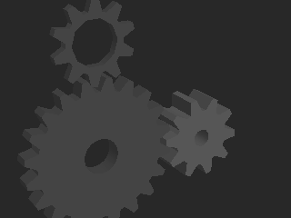

**glxgears f60: PASS**  
  

**glxheads f3: PASS**  
 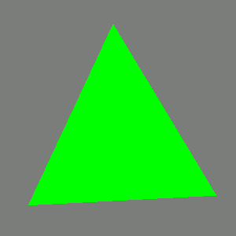 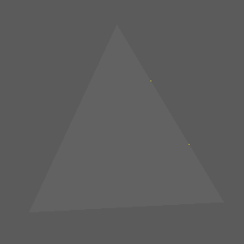

**glxheads f20: PASS**  
 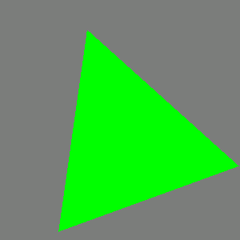 

**glxheads f60: PASS**  
  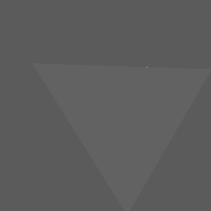

**manywin f4: PASS**  
 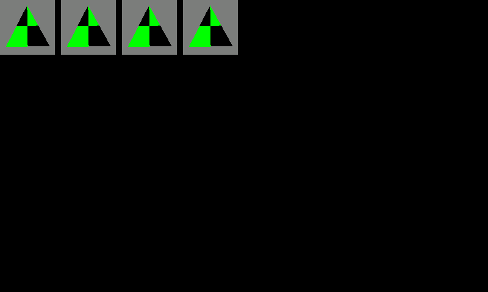 

**manywin f20: PASS**  
  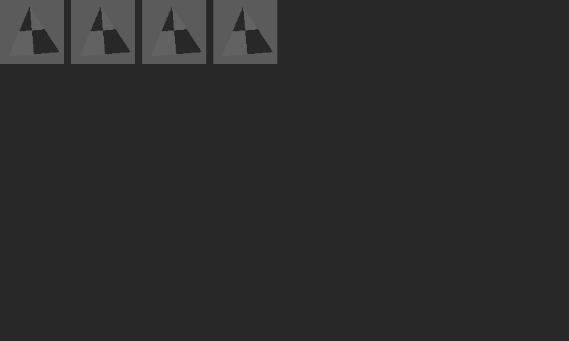

**manywin f60: PASS**  
 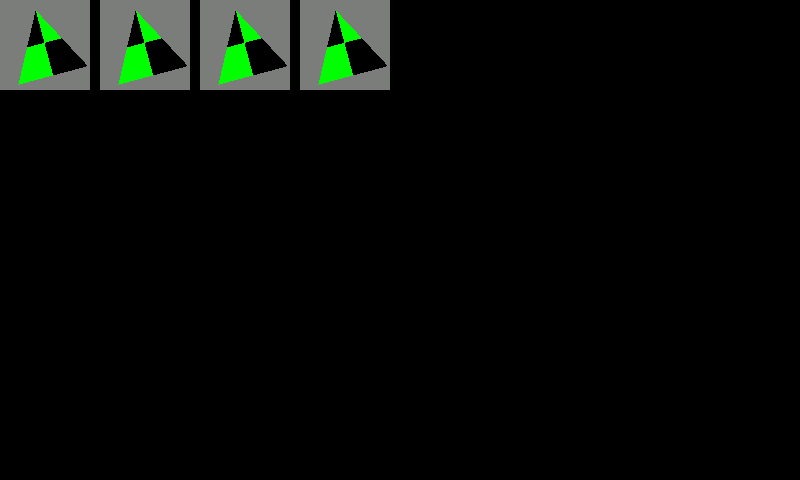 

**multictx f20: PASS**  
  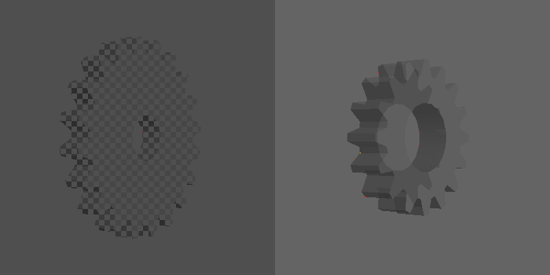

**offset f1: PASS**  
 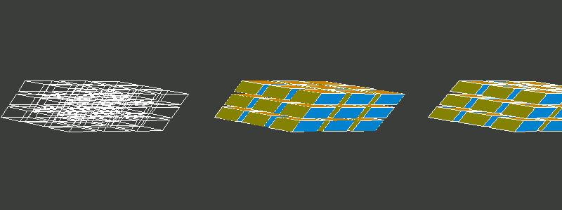 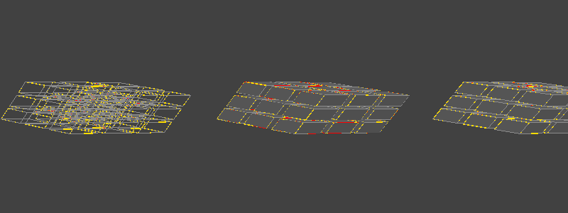

**glxgears_fbconfig f3: PASS**  
 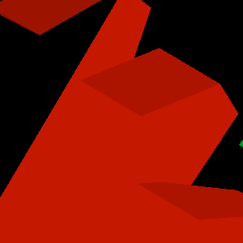 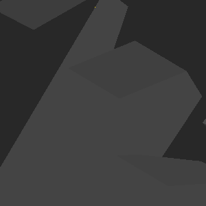

**glxgears_fbconfig f20: PASS**  
  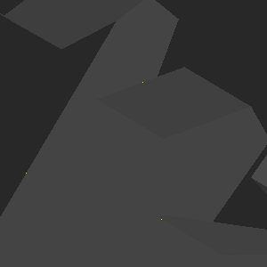

**glxgears_fbconfig f60: PASS**  
 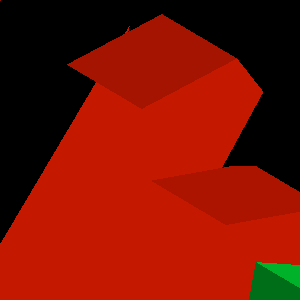 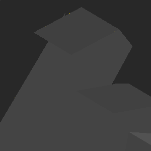

**gears f3: PASS**  
  

**gears f20: PASS**  
  

**gears f60: PASS**  
  

**morph3d f3: PASS**  
 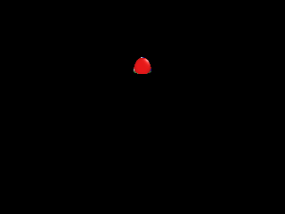 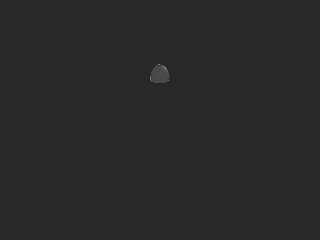

**morph3d f20: PASS**  
 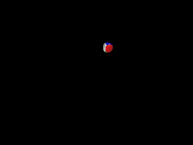 

**morph3d f60: PASS**  
 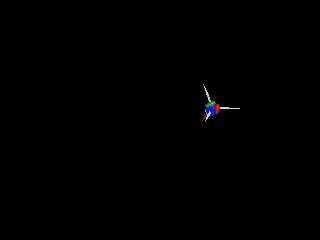 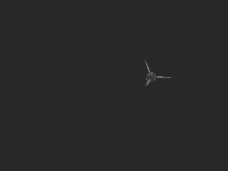

**bounce f3: PASS**  
 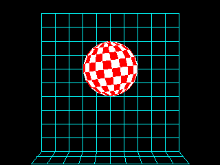 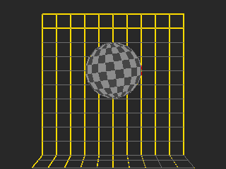

**bounce f20: PASS**  
 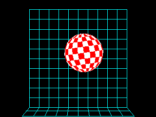 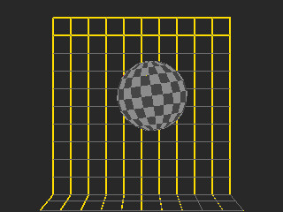

**bounce f60: PASS**  
 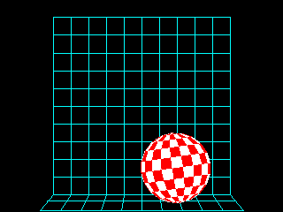 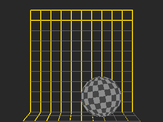

**spectex f3: PASS**  
 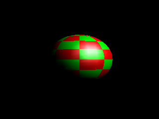 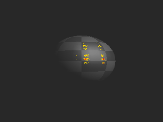

**spectex f20: PASS**  
  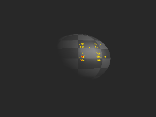

**spectex f60: PASS**  
 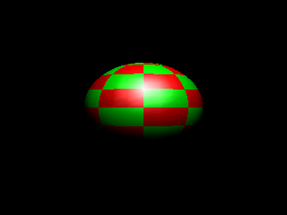 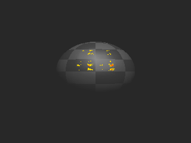

**geartrain f3: PASS**  
 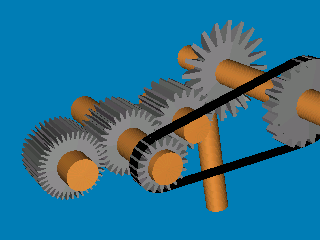 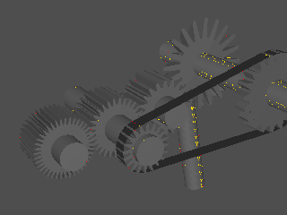

**geartrain f20: PASS**  
 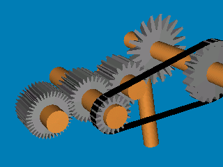 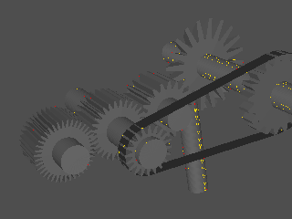

**geartrain f60: PASS**  
  

**ipers f3: PASS**  
 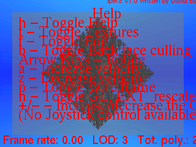 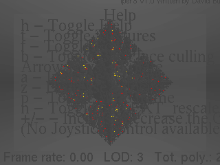

**ipers f20: PASS**  
 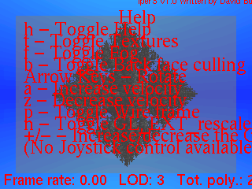 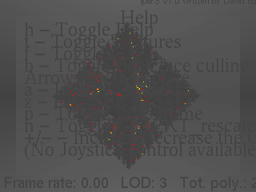

**ipers f60: PASS**  
 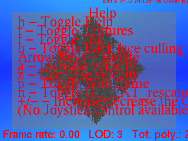 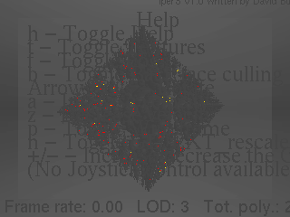

**terrain f3: PASS**  
 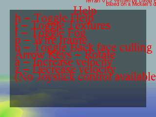 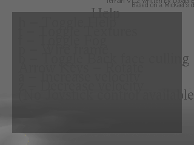

**terrain f20: PASS**  
 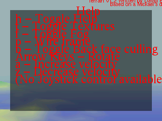 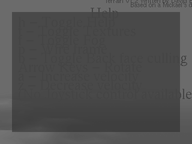

**terrain f60: PASS**  
 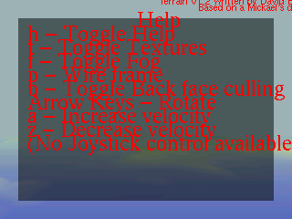 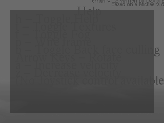

**tunnel f3: PASS**  
 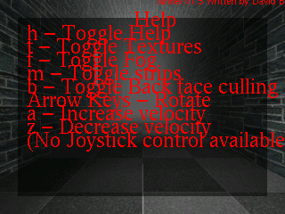 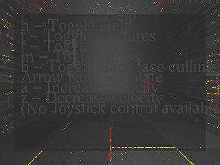

**tunnel f20: PASS**  
  

**tunnel f60: PASS**  
  

**fire f3: FAIL**  
  

**fire f20: FAIL**  
  

**fire f60: FAIL**  
  

**teapot f3: FAIL**  
  

**teapot f20: FAIL**  
  

**teapot f60: FAIL**  
  

**texcyl f3: PASS**  
  

**texcyl f20: PASS**  
  

**texcyl f60: PASS**  
  

**isosurf f1: PASS**  
  

**testgl f3: PASS**  
  

**testgl f20: PASS**  
  

**testgl f60: FAIL**  
  

**testgl2 f3: ERROR**  
 - -

**testgl2 f20: ERROR**  
 - -

**testgl2 f60: ERROR**  
 - -

**rrootage f3: MISSING-SYMBOL**  
  

**rrootage f60: MISSING-SYMBOL**  
  

**rrootage f300: MISSING-SYMBOL**  
  

## xlite load arm (board X stack, load time only)

Each app and the GL libraries it loads, resolved with `ldd -r` (every
relocation, as musl binds) against our libGL + xlite libX11 + xstubs
libXext (+ xlite's libXrandr/libXxf86vm), built for the host from the
repo sources; libXi/libXrender are the host's, standing in for the
board's. LOADS means no undefined symbol; it says nothing about what
the calls then do.

| app | result | undefined symbols (library) |
|---|---|---|
| glxgears | LOADS | |
| glxinfo | LOADS | |
| glxheads | LOADS | |
| manywin | LOADS | |
| multictx | LOADS | |
| offset | LOADS | |
| glxgears_fbconfig | LOADS | |
| gears | LOADS | |
| morph3d | LOADS | |
| bounce | LOADS | |
| spectex | LOADS | |
| geartrain | LOADS | |
| ipers | LOADS | |
| terrain | LOADS | |
| tunnel | LOADS | |
| fire | LOADS | |
| teapot | LOADS | |
| texcyl | LOADS | |
| isosurf | LOADS | |
| testgl | LOADS | |
| testgl2 | LOADS | host SDL2 only, not counted (board SDL2 binds X11 at run time): XdbeAllocateBackBufferName XdbeBeginIdiom XdbeDeallocateBackBufferName XdbeEndIdiom XdbeFreeVisualInfo XdbeGetBackBufferAttributes XdbeGetVisualInfo XdbeQueryExtension XdbeSwapBuffers Xutf8DrawString Xutf8ResetIC Xutf8TextExtents |
| rrootage | LOADS | host SDL2 only, not counted (board SDL2 binds X11 at run time): XdbeAllocateBackBufferName XdbeBeginIdiom XdbeDeallocateBackBufferName XdbeEndIdiom XdbeFreeVisualInfo XdbeGetBackBufferAttributes XdbeGetVisualInfo XdbeQueryExtension XdbeSwapBuffers Xutf8DrawString Xutf8ResetIC Xutf8TextExtents |

22 load, 0 would abort at load on the board.

These are gaps in xlite / the stub libraries (not libGL: every gl*/glX*
import resolves). Owners: xlite for libX11 names, xstubs for libXext.
